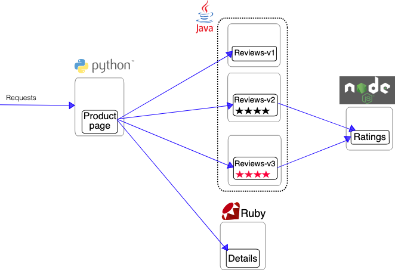

# Ejercicio: Despliegue de la aplicación _Bookinfo_ en Kubernetes

En este ejercicio, desplegarás la aplicación _Bookinfo_ utilizando Pods y Deployments en un clúster de Kubernetes. Este ejercicio se centrará en el despliegue de Pods y Deployments sin el uso de servicios de Kubernetes, enfocándose en la comunicación directa entre los Pods utilizando sus direcciones IP. También aprenderás a configurar variables de entorno que los Pods necesitarán para interactuar entre sí.

La aplicación _Bookinfo_ es una aplicación de demostración que muestra una página web de una tienda de libros. Esta creada por istio para demostrar su producto. Aquí un diagrama de la aplicación:



## Objetivos

1. Desplegar los servicios de la aplicación _Bookinfo_ como Pods individuales con las variables de entorno correctas.
2. Reemplazar los Pods por Deployments que faciliten la gestión de escalado y actualizaciones.
3. Implementar las diferentes versiones del servicio `reviews` usando el mismo Deployment.
4. Validar que los Pods se están comunicando correctamente.

### Imágenes Docker disponibles:

- **Productpage**: `istio/examples-bookinfo-productpage-v1`
- **Details**: `istio/examples-bookinfo-details-v2`
- **Reviews v2**: `istio/examples-bookinfo-reviews-v2`
- **Reviews v3**: `istio/examples-bookinfo-reviews-v3`
- **Ratings**: `istio/examples-bookinfo-ratings-v1`

### Requisitos del Ejercicio:

1. **Crear Pods con variables de entorno:**

   - Despliega los Pods para cada servicio (`productpage`, `details`, `reviews`, `ratings`). Lo mejor es que lo hagas en el orden de menor a mayor dependencia.
   - El servicio `reviews`, empieza publicando la versión v2, despues practicaremos actualizar a la versión v3.
   - Para el servicio `reviews`, necesitarás configurar las variables de entorno `RATINGS_HOSTNAME` y `RATINGS_PORT` para que pueda comunicarse con el servicio `ratings`.
   - Para el servicio `productpage`, necesitarás configurar las variables de entorno `REVIEWS_HOSTNAME`, `DETAILS_HOSTNAME`, `RATINGS_HOSTNAME` para que pueda comunicarse con sus dependencias.
   - De momento solo necesitaras la IP (sin http delante ni puerto ni la barra final).
   - El puerto por defecto de todos los servicios es 9080

2. **Validación en Minikube:**

   - Para probar que la aplicación está funcionando en Minikube, usa port-forwarding para acceder a los Pods directamente.
   - Selecciona el Pod de `productpage` y redirige un puerto local al puerto 9080 del Pod:
     ```bash
     kubectl port-forward <POD_NAME_PRODUCTPAGE> 8080:9080
     ```
   - Luego, accede a `http://localhost:8080` desde tu navegador para verificar que la página de _Bookinfo_ se muestra correctamente.
   - Verifica también que los detalles del libro, las reseñas y las valoraciones se muestren correctamente dependiendo de las variables de entorno configuradas.

3. **Migrar a Deployments:**

   - Una vez que los Pods estén en ejecución, migra cada uno a un Deployment.
   - Si vas justo de tiempo, el servicio más prioritario a migrar es `reviews`, ya que en el siguiente paso vamos a actualizarlo.
   - Configura los Deployments con un número de réplicas mínimo de 2 para cada servicio.
   - Recuerda que las variables de entorno también deben estar presentes en los Deployments, pero ahora deberás asegurarte de que los Pods de cada Deployment utilicen las direcciones IP correctas.

4. **Actualiza el servicio `reviews`:**

   - Actualiza el deployment de `reviews` para que utilice la versión 3 del servicio.
   - Deberás configurar de nuevo el valor de la variable de entorno `REVIEWS_HOSTNAME` en el servicio `productpage` para que pueda comunicarse con la nueva versión.
   - Comprueba que la aplicación sigue funcionando correctamente después de la actualización y que las reviews ahora muestran estrellas rojas.
